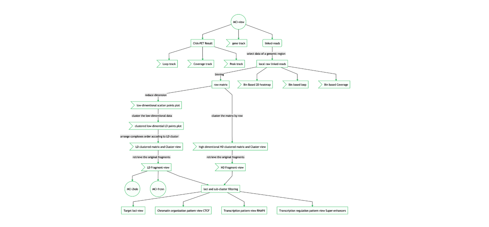
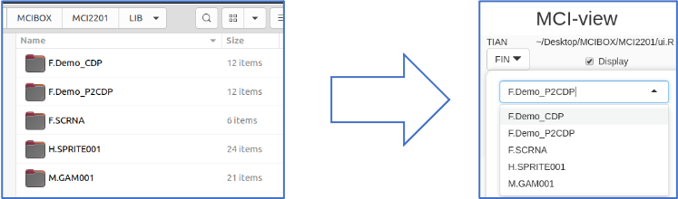
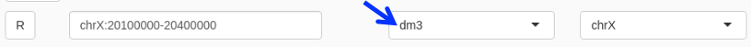
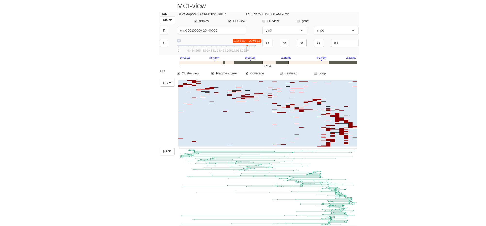
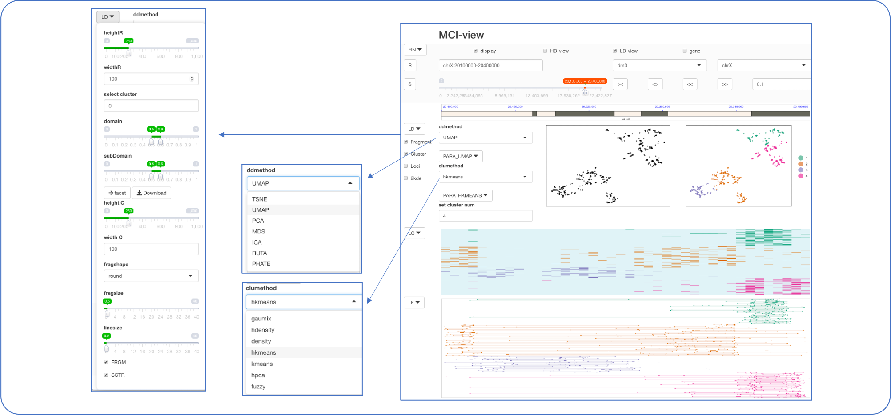
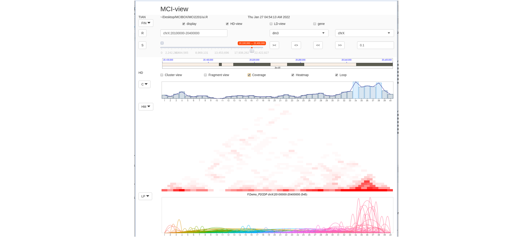
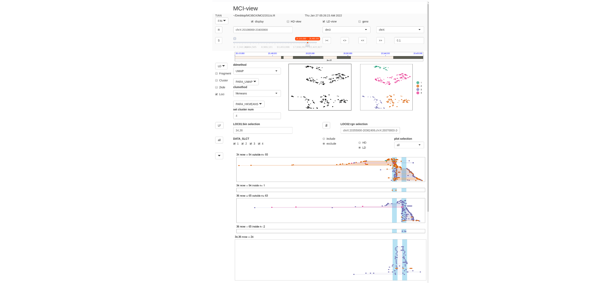
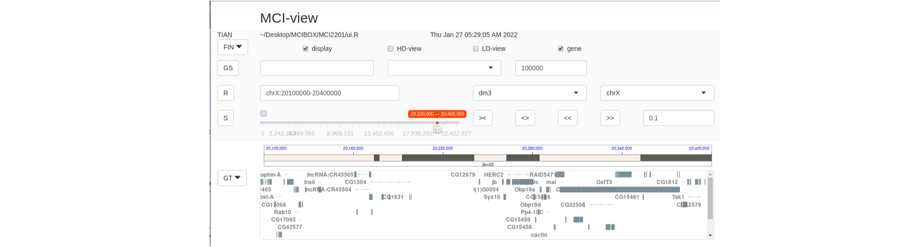
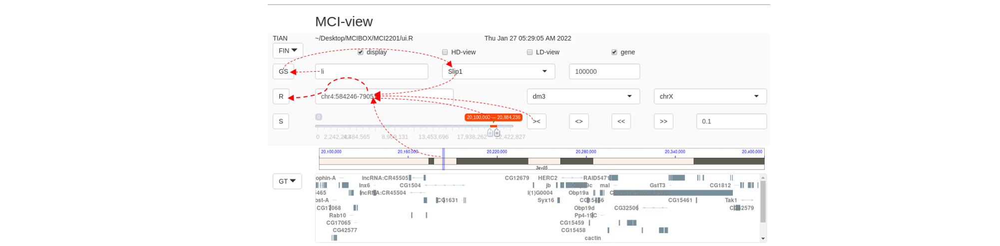
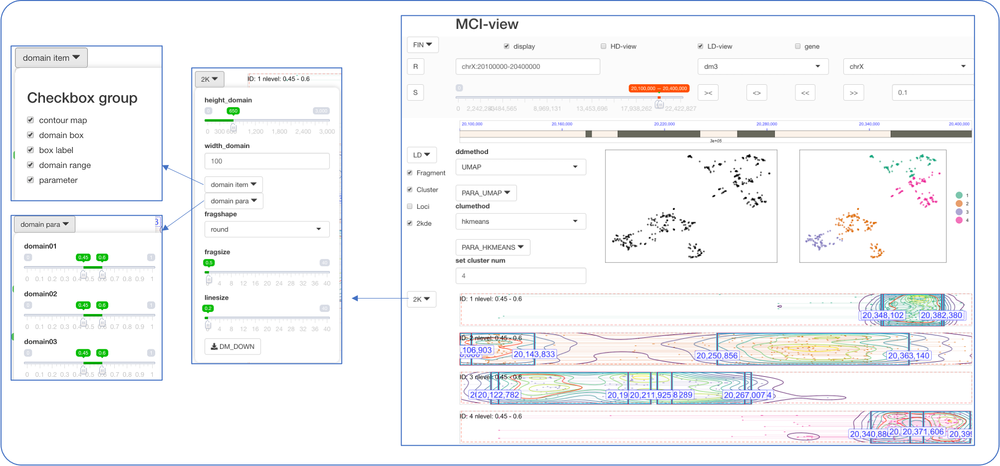

# Source code is on the way ......


# MCIBox
Tian, Zhongyuan recent update on 2022Feb for Version 1.0

### [A. MCI-view](https://github.com/tianzhongyuan/MCI-view)

MCI-view: a multiplex clustering algorithms based browser for single-molecule chromatin interaction visualization.


### [B. MCI-2kde](https://github.com/tianzhongyuan/MCI-view)
MCI-2kde: a two-dimensional kernel density estimation algorithm based unsupervised machine learning method for micro-domains definition automatically.

***

#  A. MCI-view 

***

* MCI-view is a [Shiny Server](https://shiny.rstudio.com) visualization browser for multiplex-chromatin interaction data.
* Data used in MCI-view:[SPRITE](https://linkinghub.elsevier.com/retrieve/pii/S0092867418306366), [GAM](https://www.nature.com/articles/nature21411), [ChIA-Drop and RNAPII CHIA-Drop](http://www.nature.com/articles/s41586-019-0949-1).

 

### 1. Source Data Preparation

#### 1.1 Create RGN file


* RGN is a file formate that MCI-view required, which includes following columns seprated by TAB:
```
chromsome start end fragment_number complex_id 
```
* RGN file is generated by [ChIA-DropBox](https://github.com/TheJacksonLaboratory/ChIA-DropBox) pipeline, which is a tool to process ChIA-Drop/RNAPII ChIA-Drop data. It also supplies interfaces for SPRITE and GAM generating RGN files and statistic information.

#### 1.2 Split RGN file by chromsome
* RGN file is then splited by chromosomes and compressed to RDS formate (we defined as: "chr2L.SUBRDS.smp"), which is a special data format of R.
* Copy the direrctory (e.g.: M.GAM0001) of these RDS files to the DATA/ folder.
* Tools to convert RGN file to SUBRDS.smp are listed in the MKRDS/ directory.
### 2. Installation


#### 2.1 MCI-view Runtime Environment

Current version MCI-view is a [Shiny](https://www.rstudio.com/products/shiny/shiny-server) based web browser launched by [RStudio](https://www.rstudio.com/) in a [Ubuntu](https://ubuntu.com/) circumstance. 

```
OS = Ubuntu 20.04.3 LTS
R = version 3.6.3
RStudio = 2021.09.0+351 Ghost Orchid (desktop)
Shiny = 1.7.1
```
#### 2.2 Install R Package for MCI-view
* When we run MCI-view for the first time, RStudio will ask us to install some R packages, please choose to install all by default.
* The package installation process may require us to restart MCI-view several times, please do so until MCI-view can display the interface.

#### 2.3 Run MCI-view Shiny Browser
```
1. Install RStudio in our local machine according to 2.1
2. Install all packages in you RStudio according to 2.2 
3. In RStudio launching ui.R or server.R in you cloned directory to run MCI-view
```

***

### 3. Data Loading

#### Loading Data Source

* After preparing the data source through STEP-1, the directory of the data source needs to be copied to the DATA directory in the MCI-view directory, and then restart the MCI-view program, we can be in the FIN drop-down menu. The newly added data source has been found.

>  

* Defaultly, the header of each source data represents its species (F=fly; H=human; M=mouse). 
* Change refrence genome, after you changed to a new data of a different species:

 


### 4. High Dimension View


 


### 5. Low Dimension View


 

### 6. Views for Accumulated Bin based Data
 

### 7. Views for Loci Filtering Data

 

* Transcription pattern view (RNAPII)
* Chromatin organization pattern view (CTCF)
* Transcription regulation pattern view (Super-enhancers)
* Target loci view 

### 8. Gene Track

 

### 9. Access From Gene Name

 


***
***
# B. MCI-2kde


* MCI-2kde is a two-dimensional kernel density estimation algorithm based unsupervised machine learning method for micro-domains definition automatically.

* Operation Process:
  1. Select __LC-view__ checkBox in the FIN-panel.
  2. Select __Fragment__ and __Cluster__ checkBoxes in the LD-panel.
  3. Select __2kde__ checkBox in the LD-panel.
  4. Then in 2K-Panel, Fragment-views of clusters, with density contour map, and the defined microTF square boundaries.
  5. One could adjust the microTF boundaries by adjusting nlevel range parameters in the __2K__ dropdownList.
  6. Click the __DM_DOWN__ button within  2K-dropdownList, one can save the microTF information.
  7. One can select/unselect checkbox of visulization from the __domain item__ dropdownList
  

 

